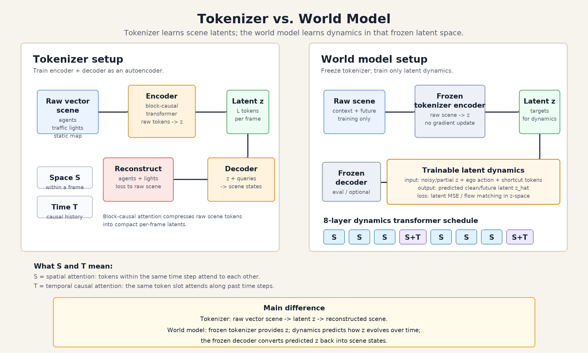

# World Model vs. Tokenizer



The editable source figure is `world_model_vs_tokenizer.svg`; use the PNG above for easy viewing in Markdown previews and slides.

Short explanation:

The tokenizer is trained as an autoencoder for vectorized Waymo scenes. Its encoder reads raw agent, traffic-light, and map tokens and compresses each frame into a small set of latent tokens `z`. Its decoder reconstructs agent and traffic-light states from `z`.

The world model does not learn this representation from scratch. We freeze the trained tokenizer, use its encoder to convert scenes into latent tokens, and train a separate dynamics transformer to predict future/clean latent tokens in this frozen latent space. During evaluation, the frozen decoder converts the predicted latents back to scene states.

In the 8-layer dynamics transformer, every block has spatial attention, and every 4th block also has temporal attention:

```text
S, S, S, S+T, S, S, S, S+T
```

Here, `S` means attention across tokens within the same time step, such as action, shortcut-signal, latent spatial, and register tokens. `T` means causal attention along the time axis, so each token slot can use its past history but not future frames.
